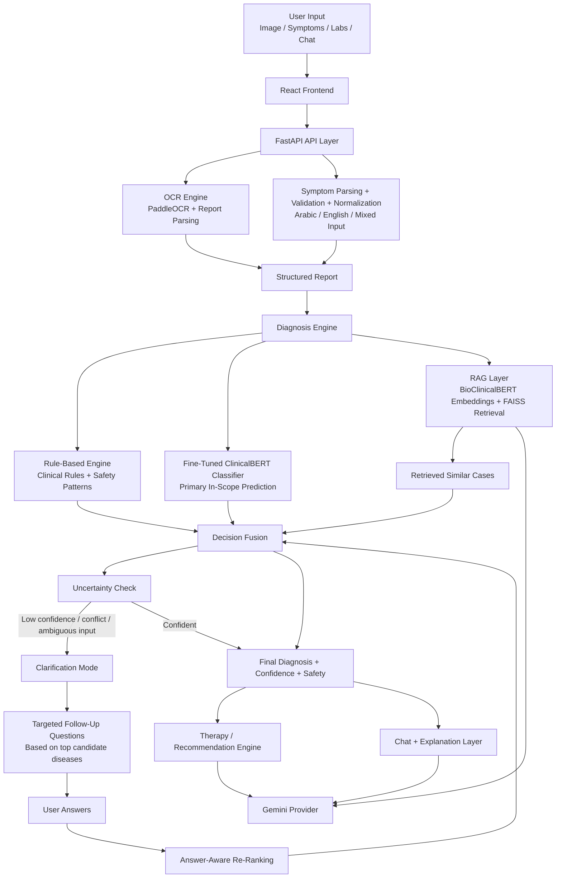

# Hybrid NLP Medical Assistant Architecture

## High-Level Diagram

## Architecture Summary

- `Frontend`: React UI for image upload, text entry, results, and clarification flow.
- `API / Orchestration`: FastAPI plus `ChatManager` coordinates OCR, parsing, diagnosis, therapy, and chat.
- `Input Understanding`: The normalization layer converts noisy free text into a training-like clinical representation.
- `Diagnosis Core`: Hybrid combination of rules, fine-tuned classifier, and RAG retrieval.
- `Interactive Refinement`: If confidence is insufficient, the system asks follow-up questions tied to suspected diseases, then reranks.
- `Output Layer`: Returns diagnosis, safety metadata, therapy suggestions, and chat/explanations.

## Current Design Message For Defense

The most accurate way to present this architecture is:

> A hybrid, multilingual, interactive clinical decision-support prototype.

Not:

> A one-shot medical diagnosis model.
